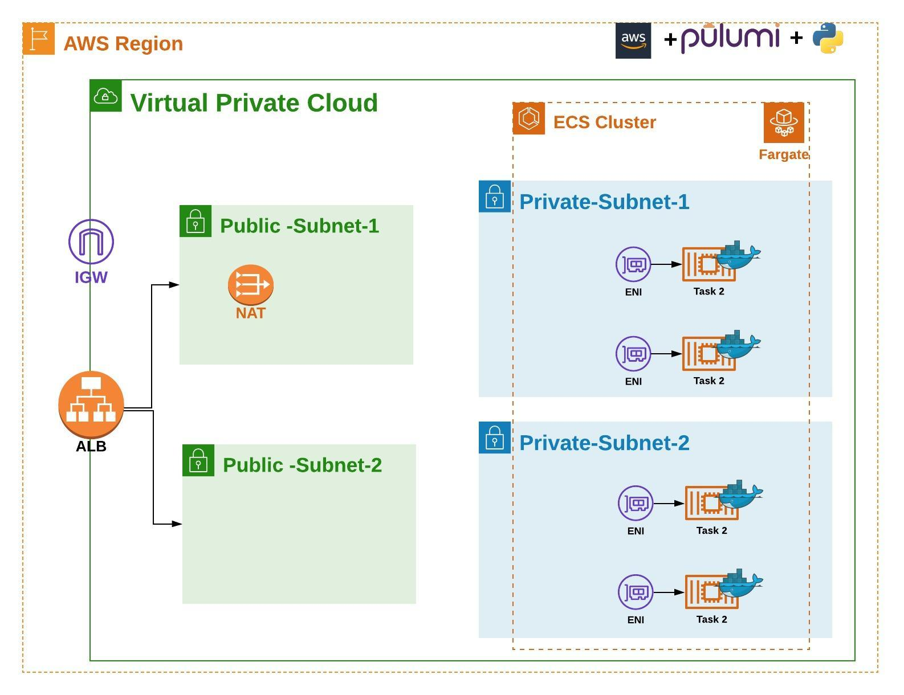

# Tech Insiders Globant 2020

This project deploy a microservice in AWS ECS, this one was create in Python and the infrastructure to support it can be launched by Pulumi.

# Requirements 

* **Pyhton:** Infrastructure and microservices was built in python. you need to install Python version 3.6 or later is required.
* **AWS Account:** The Pulumi code was created to deploy resources in AWS Cloud, you need to have an account and create an IAM user with programmatic access.
* **Pulumi Account:** To store the state of your infrastructure and manage your project you need to create a Pulumi account, please follow this link to more information.

Go through the Pulumi documentation to install Pulumi CLI
 https://www.Pulumi.com/docs/intro/console/accounts-and-organizations/accounts/
* **Pulumi CLI:** To manage Pulumi you need to install Pulumi CLI, with the CLI you can deploy infrastructure changes in your cloud provider.

Go through the Pulumi documentation to install Pulumi CLI.
https://www.Pulumi.com/docs/get-started/install/

# AWS Architecture



# Structure

In the infrastructure folder is the python code used to deploy the AWS resources. This code use python local package and are stores in aws_components folder, this folder contains a package for each component required.
Pulumi uses a python virtual environment, the file requirements.txt is used to specify the package that the code will use into the virtual environment, feel free adding new package if the code requires them.

# Set up a environment

When you create a Pulumi account, Pulumi creates an organization by default, for a free account you can create only one organization. Each organization can have projects and stacks.

1. Login
With the account already create and Pulumi CLI installed you can authenticate your terminal with Pulumi service.

```sh
$ Pulumi login
```
 Pulumi will prompt you for an access token, including a way to launch your web browser to easily obtain one. 

 2. Create Pulumi project


# Deploy 
